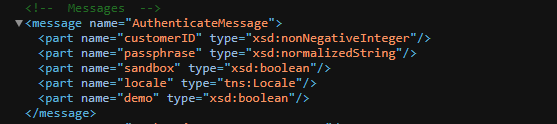
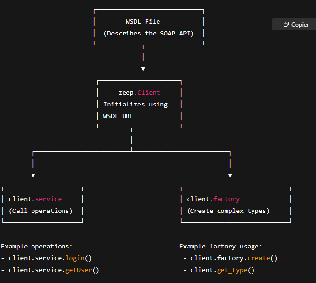

# trade_tracker_api
# Notes

i got bored duing the weekend — the sun was too much, the garden is full of screaming kids, and my brain needed a different kind of distraction. something a bit more technical, something to chew on. so i went looking and stumbled across replit bounties. seemed fun at first, but i’m not really in the mood to enter a cash-prize race with strangers. instead, i thought i’d just pick a challenge, build it for fun, and publish the result here.

> if you ever find any of this useful — take it, it’s yours.  
> unless you’re gonna make over $100k with it. in that case, you better let me in.

---

## First Trader Tracker

First Trader Tracker is one of those affiliate marketing networks, I guess. Sellers put their products and marketers find affiliation offers — cool. This is like ClickBank.

Trader Tracker uses SOAP protocol.

---

### Initial Questions

- What is SOAP?

Hmm ok, SOAP is just another webservice protocol like REST. So building a SOAP client API should be a Python code that enables me to send requests using the SOAP protocol.

New question:  
I do not think this protocol uses GET, POST, PUT, and DELETE…?

---

### The Real First Consequential Question

> **How to Extract performance metrics from TradeTracker using their SOAP API?**

To interact using this SOAP protocol, I need to follow exactly the XML format.

I should use the `zeep` library as I read online — it's a SOAP Python client.

---

### Authentication

To authenticate from Python, I should send a request with an object that has these properties:

- `customerID`
- `passphrase` (I guess this is the password)
- `sandbox` (not sure what this is)
- `locale`
- `demo`

You can clearly guess their types by the screenshot below:



---

### Zeep Architecture

ChatGPT gave me a graph to help me understand how Zeep works:



---

### Sketch of the TradeTrackerAPI Class

```python
class TradeTrackerAPI:
    def __init__():
        settings = Settings(strict=False, xml_huge_tree=True, ...)
        transport = Transport()
        self.client = Client()
        self.session = Session()

    def __authenticate__(self, customer_id, passphrase, sandbox, locale):
        try:
            return self.client.service.authenticate(
                customerID=customer_id,
                passphrase=passphrase,
                sandbox=sandbox,
                locale=locale,
                demo=False
            )
        except Exception as e:
            print(f"Auth failed: {str(e)}")
            raise
